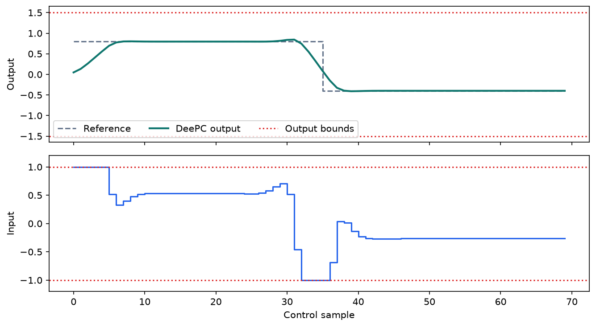
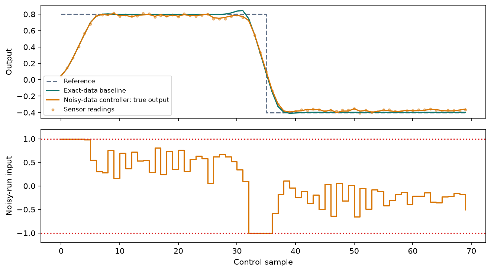

# DeePC: control directly from experimental data

[](https://molab.marimo.io/github/chetools/codex/blob/main/deepc-tutorial/deepc.py)

An executable, step-by-step tutorial on data-enabled predictive control,
based on [Coulson, Lygeros, and Dörfler (2019)](https://arxiv.org/abs/1811.05890).
The small two-state example is original; it does not reproduce the paper's
quadcopter case study.

## Open and share

Click **Open in molab** above to open the GitHub-hosted notebook. Use molab's
Python compute runtime to execute it; signing in may be required to run or save
a copy. The notebook uses native optimization packages and is intended for a
Python runtime, not a WebAssembly-only preview.

`deepc.py` is the complete marimo notebook. It includes all explanations,
code, plots, interactive input-penalty control, and inline dependency metadata.
It has no local-module imports, downloads, or external data requirements.
Share the notebook link directly; recipients do not need the other files.

## Run locally

Install [uv](https://docs.astral.sh/uv/getting-started/installation/), then run
these commands from this folder:

```sh
# Open the interactive notebook, installing its declared dependencies in isolation.
uv run --with marimo==0.25.0 marimo edit --sandbox deepc.py

# Execute all cells and the embedded numerical checks without opening an editor.
uv run deepc.py

# Test the default and both endpoints of the input-penalty slider; save plots.
uv run verify.py --output results

# Check marimo cell structure.
uv run --with marimo==0.25.0 marimo check deepc.py

# Produce a static, executed HTML copy with code (widgets are not live in this export).
uv run --with marimo==0.25.0 marimo export html --sandbox deepc.py -o deepc.html
```

Use Python 3.12-3.14 as specified in the inline metadata. `uv run` resolves the
dependencies automatically; no manual package installation is necessary.
Direct dependencies are versioned in the notebook; this is not a full transitive
lockfile. Numerical results can vary slightly by platform and solver build.

## What you will learn

1. Collect an informative input/output experiment with consistent timing.
2. Construct and partition block Hankel matrices.
3. Check persistent excitation and understand the initialization window.
4. Translate the data-based trajectory constraint into a CVXPY optimization.
5. Implement receding-horizon tracking with input/output limits.
6. Verify prediction against the simulator and optimization against known-model MPC.
7. Add measurement noise, history slack, and one-norm regularization.
8. Replace the simulated recording with real experimental measurements.

The controller only receives input/output data; plant matrices appear solely
in the simulated equipment and independent MPC benchmark. The exact-data
example implements Equation (6). The noisy extension uses two penalties from
Equation (8), explicitly omitting low-rank approximation.

## Validation and limitations

`verify.py` executes the actual notebook at input penalties 0.01, 0.1, and 1.0.
It checks full-horizon MPC input/output agreement, objective agreement, simulator
prediction, closed-loop constraints, Hankel indexing, and the noisy example.
Running with `--output results` also saves three plots and a JSON report.

The MPC comparison has a `1e-4` absolute trajectory tolerance and `1e-5` objective
tolerance; exact prediction and bound checks use `1e-6`. Solver status must be
optimal. OSQP handles the exact problem with polishing; CLARABEL handles the
one-norm regularized problem. The two solvers are selected explicitly, not as
silent fallbacks.

Finite-horizon optimality does not by itself establish stability or recursive
feasibility. The noisy example is illustrative, with no exact equivalence or
real-plant constraint guarantee. Tracking may have a steady offset because
the objective penalizes absolute input effort.

## Example output





The committed [verification report](verification.json) records a successful
local run. Regenerate it and the plots with `uv run verify.py --output results`.
